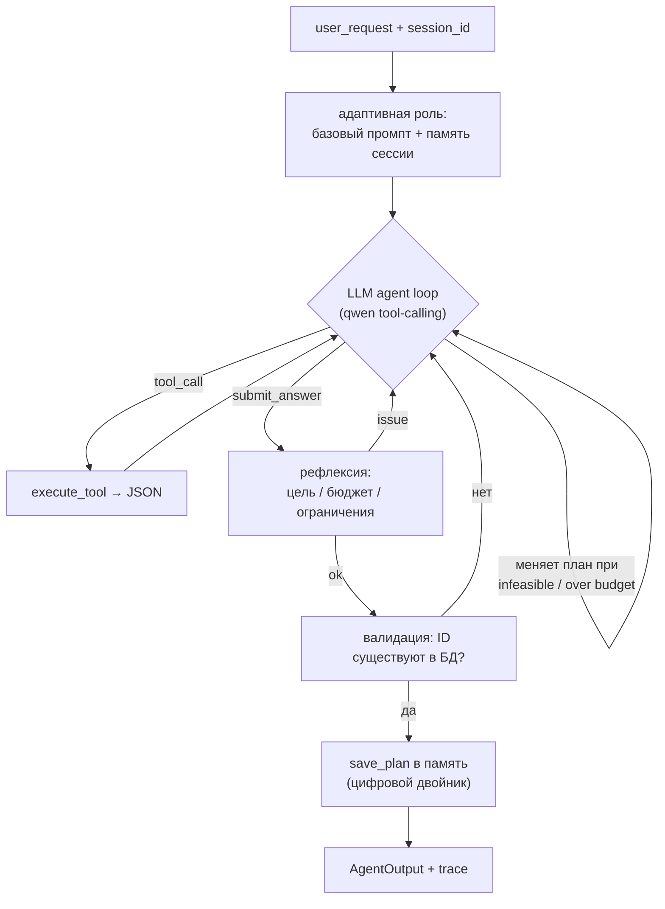

# travel-planning-agent — запуск и архитектура

LLM-driven агент планирования путешествий: подбирает перелёт, отель и пакетный тур
для группы с учётом состава, бюджета, дат, ограничений и предпочтений; умеет
уточнять, эскалировать, отказывать и **самостоятельно перепланировать**. Все решения
(что вызвать, какой исход вернуть) принимает модель **qwen2.5:7b** (через Ollama) в
tool-calling цикле — детерминированной if-логики маршрутизации нет.

## Архитектура (LLM-driven)



**Ключевой инвариант — не детерминизм, а валидация.** Модель свободно рассуждает и
выбирает инструменты, но финальные `flight_id/hotel_id/tour_id` проверяются на
существование в БД; галлюцинированные ID отбрасываются (исход понижается до
`clarification`). За весь E2E-прогон — **0 галлюцинированных ID в финальных ответах**.

## Признаки агентной зрелости (что реализовано)

| Способность | Реализация |
|---|---|
| Reasoning | Модель строит и **меняет** цепочку tool-вызовов по результатам (переплан при infeasible/over budget) |
| Action | Нативный tool-calling: модель сама формирует структурированные вызовы (`tools_spec.py`) |
| Reflection | Шаг само-оценки результата (`_reflect`): при явной ошибке — возврат в цикл |
| Memory | Внешняя долгосрочная память-«цифровой двойник» (`data/memory/<session>.json`), `recall/save` как инструменты, многоходовость |
| Role | `system_prompt` дополняется контекстом из памяти сессии по ходу взаимодействия |
| Autonomy | Не спрашивает подтверждения промежуточных действий |
| Domain | RAG по policy-документам (`retrieve_policy`) |

## Структура кода

| Слой | Файлы | Назначение |
|---|---|---|
| Данные/tools | `src/travel_agent/tools/` | `db`, `groups`, `flights`, `hotels`, `tours`, `budget`, `trip_options` |
| RAG | `src/travel_agent/rag/retriever.py` | лексический поиск по `data/documents/*.md` |
| Агент | `src/travel_agent/agent/` | `tools_spec` (схемы+диспетчер), `llm_backend` (qwen tool-calling), `agent_loop` (ReAct+рефлексия), `memory`, `runner` (адаптивная роль), `tracing`, `schema` |
| Оценка | `src/travel_agent/evaluation/` | `loaders`, `metrics`, `run_qa_eval` |
| CLI/конфиг | `main.py`, `configs/agent.yaml`, `.env.example` | единый запуск, настройки |
| Промпт | `prompts/system_prompt.md` | базовый системный промпт |

## Установка

```bash
# из корня репозитория (общий venv)
venv/bin/pip install -r travel-planning-agent/requirements.txt

# локальная модель через Ollama (нужна для работы агента)
ollama pull qwen2.5:7b      # модель по умолчанию
ollama pull qwen2.5:3b      # быстрее, но слабее на финальном submit_answer
```

Скопируйте `.env.example` → `.env` при необходимости (адрес Ollama, имя модели).

## Запуск

Команды — из каталога `travel-planning-agent/` (пути к данным заякорены на корень).

```bash
# Одиночный запрос (с группой)
python main.py -g G-0001 -r "Подбери поездку в Стамбул на 5 ночей"

# Справочный (info) вопрос без группы
python main.py -r "Можно ли бесплатно отменить отель?"

# С трейсом (обсервабилити: длительности, LLM/tool-вызовы, токены)
python main.py -g G-0001 -r "Нужен пляжный отдых" --trace

# Многоходовый диалог с общей памятью сессии
python main.py -g G-0001 --session trip-123 --chat

# E2E-оценка по qa.jsonl → evaluation_report.md + data/eval/metrics.json
python main.py --eval
python main.py --eval --limit 7    # быстрый прогон

# Перегенерировать примеры работы с трейсами
python scripts/make_examples.py
```

### Переключение модели

```bash
QWEN_MODEL=qwen2.5:7b python main.py --eval   # по умолчанию
QWEN_MODEL=qwen2.5:3b python main.py --eval   # быстрее, но хуже финализирует
```

## Формат ответа (`AgentOutput`)

```json
{
  "outcome_type": "recommendation",      // info|recommendation|clarification|escalation|rejection
  "answer": "Рекомендуем перелёт FL-118 и отель HT-045 ...",
  "flight_id": "FL-118",
  "hotel_id": "HT-045",
  "tour_id": null,
  "estimated_total_price": 125800,
  "decision_rationale": "Утренний вылет без ночного прилёта, в бюджете.",
  "warnings": [],
  "group_id": "G-0001",
  "destination": "IST",
  "category": null,
  "status": "approved"                   // approved|clarification|escalation|rejected
}
```

## Tools и RAG

- **Tools (БД `data/travelers/travelers.sqlite`, только чтение):** профиль группы,
  поиск перелётов/отелей/туров, расчёт бюджета. Документация — `docs/TOOLS.md`,
  `docs/DB_SCHEMA.md`.
- **RAG (`data/documents/*.md`):** правила бронирования, багажа/тарифов, отелей и
  пакетных туров. Вызывается моделью через инструмент `retrieve_policy`.

## Результаты оценки (живой qwen2.5:7b)

Прогон по всем 20 кейсам `data/qa/qa.jsonl` (`evaluation_report.md`). Метрики
**недетерминированы** и заметно ниже прежней if-then реализации — это осознанный
размен ради агентной зрелости (рубрика штрафует детерминизм).

| Метрика | Значение |
|---|---|
| Task success rate | 35% |
| Outcome accuracy | 40% |
| Entity accuracy | 33% |
| Галлюцинированных ID в финале | **0** |
| Среднее число шагов рассуждения | 4.5 |
| Переплан-ирований / рефлексий (всего) | 4 / 5 |

Подробный разбор метрик и ролей МАС — `docs/METRICS.md`; ограничения и развитие —
`docs/PROBLEMS.md`; примеры прогонов с трейсами — `docs/EXAMPLES.md`.

## Воспроизводимость и тестирование

- `temperature=0`, но LLM-цикл недетерминирован (модель сама принимает решения), поэтому
  метрики могут колебаться между прогонами.
- Техническая готовность подтверждается **E2E-прогоном на живом qwen** и сохранёнными
  **примерами работы** (`docs/EXAMPLES.md`) — отдельного слоя юнит-тестов нет
  (критериями не требуется).

## Ограничения (кратко)

- Replanning-кейсы в E2E оцениваются одним ходом, без предыдущего плана в памяти →
  агент не видит «прошлый» вариант; многоходовость демонстрируется в `docs/EXAMPLES.md`.
- Эскалация/конфликты предпочтений — тонкие политики, 7B-модель распознаёт их
  нестабильно. Подробнее — `docs/PROBLEMS.md`.
- БД — read-only; реальное бронирование/оплата вне области решения.
